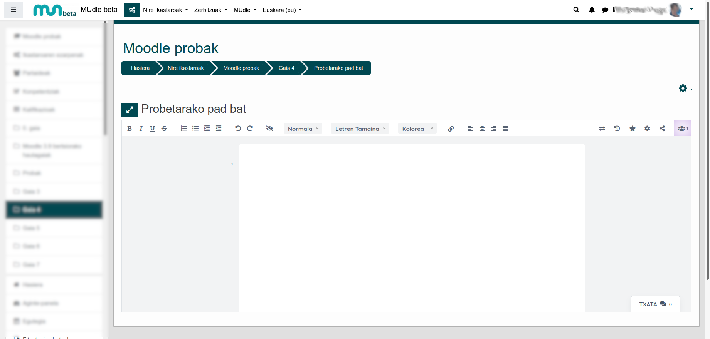
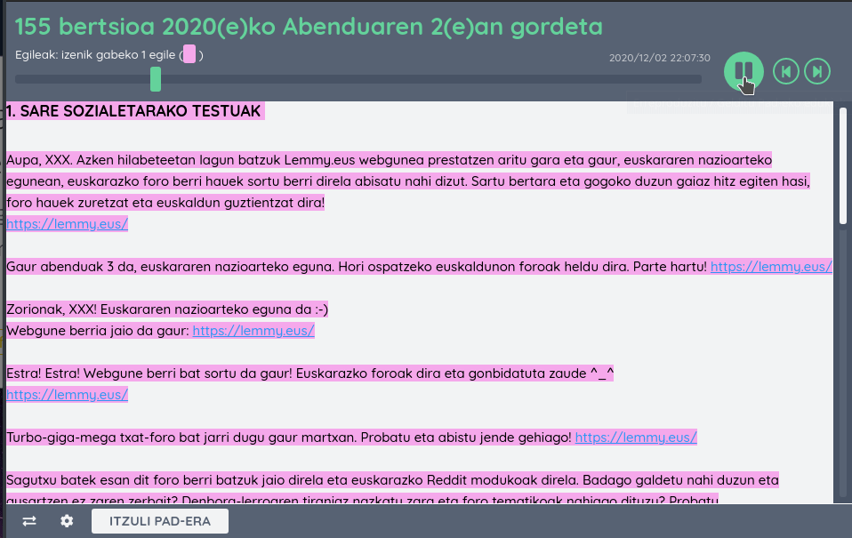
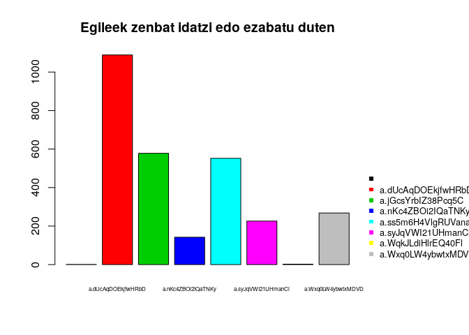
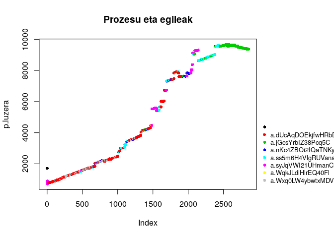
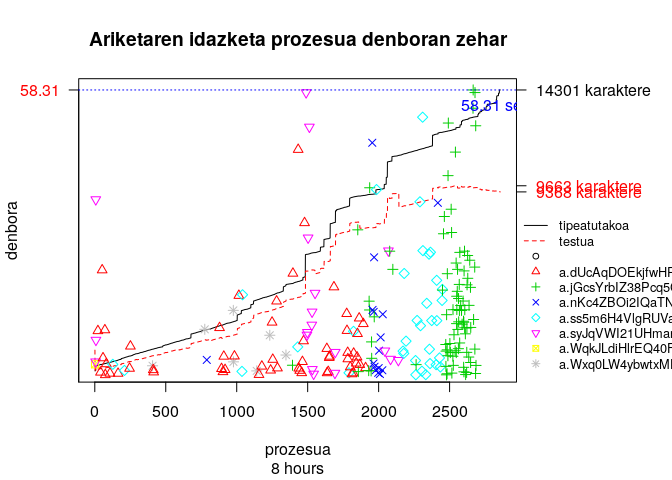

#

```{r setup, include=FALSE}
## define knitr options
knitr::opts_chunk$set(echo = FALSE) # Aldatu HTMLn leitzia nahi bada
knitr::opts_chunk$set(warning = FALSE)
knitr::opts_chunk$set(message = FALSE)

## set any missing NAs in tables to blank
options(knitr.kable.NA = '')

```

```{css css, echo=FALSE}
body {
    background-image: url(irudiak/logo.png);
    background-size: 40%;
    background-repeat: no-repeat;
    background-position: 3% 96%;
}
```

### Idatzizko talde lanak

## 

> Talde lanekin GUZTIZ nekatuta nago, jendeari gradua ateratzea iruditzen zaizkit.
>


## 47/2012 DEKRETUA

2. artikulua Unibertsitate-tituluek dakartzaten salbuespenak.

    <u>Salbuetsita</u> izango dira Hizkuntzen Europarako Erreferentzi Marko Bateratuko C1 eta C2 mailen baliokide diren euskarako hizkuntza-tituluak eta ziurtagiriak <u>egiaztatzetik</u> unibertsitate-titulu ofizialen bat duten pertsonak...


#

### IDAT

## 

```{r out.width='80%'}

```

## 



## Talde lanean

#

### Adibidea

## Taldekideen ezaugarriak

## 

```{r out.width='80%'}

```

## 

```{r out.width='80%'}

```

## 

```{r out.width='80%'}

```

# eta... gero zer?

> + **eGelan**
> + Idatziaren kokapena
> + Testuaren talde eraikuntzaren eraikuntza


# Juan  <span style="color:#FFFFFF">__Abasolo__</span> - Naia <span style="color:#FFFFFF">__Eguskiza__</span> {style='color:grey;' data-background="#000077"}


