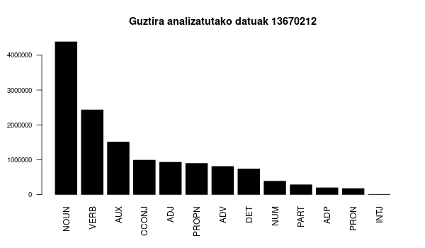
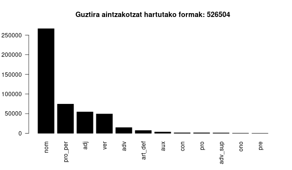
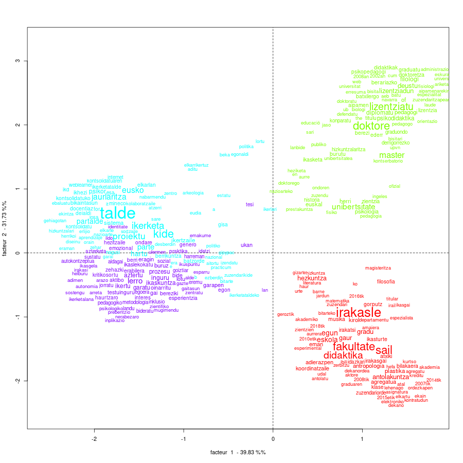
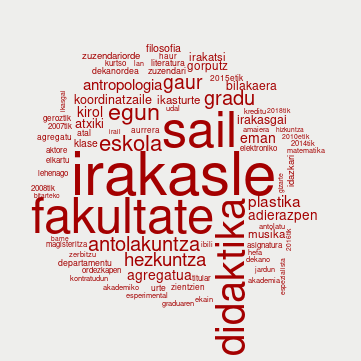

```{r setup, include=FALSE}
## define knitr options
knitr::opts_chunk$set(echo = FALSE) # Aldatu HTMLn leitzia nahi bada
knitr::opts_chunk$set(warning = FALSE)
knitr::opts_chunk$set(message = FALSE)

## set any missing NAs in tables to blank
options(knitr.kable.NA = '')

```

```{css css, echo=FALSE}
body {
    background-image: url(irudiak/logo-zuri.png);
    background-size: 40%;
    background-repeat: no-repeat;
    background-position: 3% 96%;
}
```

#

### Reinert metodoaz

## Kontzeptua

**Lehen Hezkuntzak 6-12 urte arteko nahitaezko hezkuntza aldia barne hartzen du.** <span style="color:#777777">Etapa honen helburua da haurrek garapen pertsonala zein sozio-kulturala izan dezaten laguntzea, bai eta euren bizitza osoan zehar izango duten ikaskuntzarako oinarriak prestatzen laguntzea ere. Irakaslearen irudia funtsezkoa da etapa honetan</span>.

##

+ Lehen Hezkuntzak 6-12 urte arteko nahitaezko hezkuntza aldia barne hartzen du
+ <span style="color:#DDDD00">Lehen</span> <span style="color:#DD00DD">Hezkuntzak</span> <span style="color:#555555">
6-12</span> <span style="color:#DDDD00"> urte</span> <span style="color:#DD00DD">arteko</span> <span style="color:#444444">nahitaezko</span> <span style="color:#DDDD00">hezkuntza</span> <span style="color:#DD00DD">aldia</span> <span style="color:#DDDD00">barne</span> <span style="color:#DDDD00">hartzen</span> <span style="color:#444444">du</span>. 
+ <span style="color:#DDDD00">lehen</span> <span style="color:#DD00DD">hezkuntza</span><span style="color:#555555">k 6-12</span> <span style="color:#DDDD00"> urte</span> <span style="color:#DD00DD">arte</span><span style="color:#444444">ko</span> <span style="color:#777777">nahitaez</span><span style="color:#444444">ko </span><span style="color:#DDDD00">hezkuntza</span> <span style="color:#DD00DD">aldi</span><span style="color:#444444">a</span> <span style="color:#DDDD00">barne</span> <span style="color:#DD00DD">hart</span><span style="color:#444444">zen du</span>. 

## 

1. `lehen hezkuntza urte arte aldi barne hartu`  
<span style="color:#777777">*Lehen Hezkuntzak 6-12 urte arteko nahitaezko hezkuntza aldia barne hartzen du*.</span>  
2. `etapa helburu haur garapen pertsonal soziokultural lagunt  bizitza ikaskuntza oinarri`  
<span style="color:#777777">*Etapa honen helburua da haurrek garapen pertsonala zein sozio-kulturala izan dezaten laguntzea, bai eta euren bizitza osoan zehar izango duten ikaskuntzarako oinarriak prestatzen laguntzea ere.*</span>  
3. `irakasle irudi funts etapa`  
<span style="color:#777777">*Irakaslearen irudia funtsezkoa da etapa honetan.*</span> 

#

### Euskaraz

## 

from / of / at *home*<br>

*etxe*ko<br>
*etxe*koa<br>
*etxe*koaren<br>
*etxe*an<br>
*etxe*tik<br>
...

## 



##



#

### Adibidea

## LH eta HHko irakasleok {style='color:grey;' data-background-image="irudiak/iramuteq/ehu-irakasleak.png" }

## 

```{r}
knitr::kable(data.frame(Bilbo = c(116, 80), 
                        Donostia = c(90, 47), 
                        Gasteiz = c(92, 44),
                        row.names = c('denera', 'deskribatuak')))
```

<br>

+ 1.329 zentzu unitate
+ 20.238 gertaldi
+ 3.918 forma
+ 2.374 hapax

## 

```{r out.width='80%'}
knitr::include_graphics('irudiak/iramuteq/dendrogramme_1.png')
```


##

```{r out.width='70%'}

```

##

```{r out.width='50%'}

```

##

> gaur egun irakasle atxikia da bilboko hezkuntza fakultateko didaktika eta eskola antolakuntza sailean haur hezkuntzako graduan eskola antolakuntza irakasgaia irakasten

<small>

> egun musika plastika eta gorputz adierazpenaren didaktikaren saileko irakasle atxikia naiz haur hezkuntzako graduan garapen psikomotorra eta haur hezkuntzako lehen ziklorako estrategia eta teknika psikomotor irakasgaiak ematen bilboko hezkuntza fakultatean <small>

> gaur egun irakasle atxikia naiz ehuko hezkuntza filosofia eta antropologia fakultatean didaktika et eskola antolakuntza sailean

> egun irakasle atxikia da gizarte zientzien didaktika sailean eta hezkuntza filosofia eta antropologia fakultatean hefa ematen ditu eskolak

> bilboko hezkuntza fakultatean teoria eta historiako departamentuan irakasle elkartua izandakoa 2017 2018 gaur egun didaktika eta eskola antolakuntza saileko irakaslea leioa upv ehu

</small></small>

#

### Orain zer?

## Erabiltzeko {data-background-image="irudiak/iramuteq/OSF_lexikoa.png" style='color:black;' }

**OSF**

## Hutsuneak

Nafar / Iparraldeko moldeak azpi-ordezkatua

Txarto sailkatuak :  
`daroat     daroat     nom`  
`zutelakotz zutelakotz nom`  
([`+`](https://erabili.liberaforms.org/iramuteqlexikorako))

Izen propioak

_**arte** lanak egin zituen_ Vs _lanak egin zituen **arte**_

# Juan  <span style="color:#FFFFFF">Abasolo</span> - Naia <span style="color:#FFFFFF">Eguskiza</span> {style='color:grey;' data-background="#AA0000"}

kontaktua :  `juan . abasolo @ ehu . eus`

